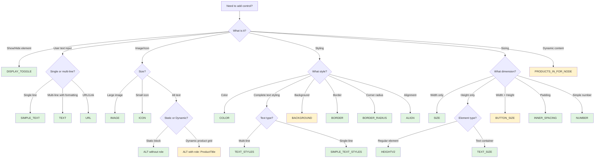
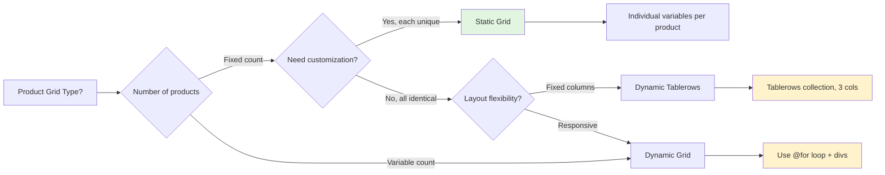

# MINDBOX EMAIL BLOCKS — KNOWLEDGE BASE v3.2

**Version:** 3.2.0  
**Last Updated:** 2025-10-28  
**Status:** Production-ready  
**Official Documentation:** [Mindbox Custom Blocks](https://docs.mindbox.ru/docs/custom-blocks)

---

## 📋 Quick Navigation

- [Priority Hierarchy](#priority-hierarchy)
- [Quick Decision Tree](#quick-decision-tree-control-type-selection)
- [Quick Error Reference](#quick-error-reference-table)
- [Allowed Values Reference](#allowed-values-reference)
- [Global Rules](#global-rules-and-terminology)
- [Control Types](#control-types)
- [HTML Structure Rules](#html-structure-rules)
- [Advanced Patterns](#advanced-patterns)
- [Complete Examples](#complete-examples)
- [Developer Checklist](#developer-checklist)
- [AI Generation Prompts (English)](#ai-generation-prompts-b)
- [Русская документация](#russian-documentation-c)
- [Changelog](#changelog)

---

## Priority Hierarchy

This knowledge base follows a strict priority hierarchy for conflict resolution:

* **[A] Priority Level A**: Normative standards (this Knowledge Base) — **HIGHEST PRIORITY**
* **[B] Priority Level B**: Generation & debugging prompts — **MEDIUM PRIORITY**  
* **[C] Priority Level C**: Documentation examples & patterns — **LOWEST PRIORITY**

**⚠️ CRITICAL RULE:** When information conflicts, always follow: **A > B > C**

---

## Quick Decision Tree: Control Type Selection



**Legend:**  
🟢 Green = Simple types | 🟡 Yellow = Complex types (requires special attention)

---

## Quick Error Reference Table

| 🔴 Symptom | ⚠️ Cause | ✅ Solution | 📍 KB Section |
|-----------|----------|------------|---------------|
| **"3-dot notation error"** | Variable path like `${editor.card.text.color}` | Flatten naming: `${editor.cardTextColor}` | [Variable Naming](#variable-naming-rules) |
| **Text disappears on render** | Missing font-size/line-height in `@{if}` block | Add inline styles: `style="font-size: 16px; line-height: 1.5;"` | [Rule 5](#rule-5-text-in-conditional-blocks) |
| **Background not working** | Using only `.background` method | Use triple method: `bgcolor=`, `style=`, `if()` condition | [BACKGROUND](#background) |
| **Button % width broken** | Wrong table structure | Use complete BUTTON_SIZE pattern with `.class` | [BUTTON_SIZE](#button_size) |
| **Dynamic grid empty cells** | Missing `@{if cell.Value != null}` | Wrap cell content in null check | [Pattern 0.1](#pattern-01-static-vs-dynamic-product-grids) |
| **Role params not populating** | Missing `defaultValue` in role params | **Always add** `defaultValue` with sample data | [Dynamic Data Roles](#dynamic-data-roles) |
| **Line height validation error** | Using values like "20px" or "2.5" | Use ONLY: "1.0", "1.15", "1.5", "2.0" | [Allowed Values](#line-heights) |
| **Unused JSON warnings** | JSON variables not referenced in HTML | Verify all JSON vars used OR remove unused ones | [Sync Checklist](#-synchronization-checklist) |
| **HTML/JSON mismatch** | Variable names don't match exactly | Names are case-sensitive, must match precisely | [Sync Rules](#json-structure-requirements) |
| **Upload rejected** | Missing first-line comment | Add `<!-- EDITOR_BLOCK_TEMPLATE: name -->` as line 1 | [Rule 0](#rule-0-editor_block_template-mandatory) |

---

## Allowed Values Reference

### Fonts
```
"Arial", "Helvetica", "Roboto", "Open Sans", "Montserrat", "Inter", "Geneva", 
"Times New Roman", "Verdana", "Courier / Courier New", "Tahoma", "Georgia", 
"Palatino", "Trebuchet MS"
```

### Line Heights
```
"1.0", "1.15", "1.5", "2.0"
```
**⚠️ CRITICAL:** ONLY these four values are allowed. No other values will work.

### Align Values
```
"left", "center", "right"
```

### Background Modes
```
"contain", "cover", "repeat", "stretch"
```

### Width Types (for SIZE/BUTTON_SIZE)
```
"pixels", "percent"
```

### Collection Types
```
"RECIPIENT_RECOMMENDATIONS", "FROM_SEGMENT", "FROM_PRODUCT_LIST", "ORDER", 
"VIEWED_PRODUCTS_IN_SESSION", "PRODUCT_LIST_ITEM", "PRODUCT_VIEW", 
"FROM_CUSTOMER_COMPUTED_FIELD"
```

### Dynamic Data Roles
```
"ProductTitle", "ProductPrice", "ProductOldPrice", "ProductUrl", 
"ProductImageUrl", "ProductDescription", "ProductBadge"
```

---

## Global Rules and Terminology

### Rule 0: EDITOR_BLOCK_TEMPLATE (MANDATORY)

**⚠️ THE FIRST LINE OF ANY HTML BLOCK MUST BE:**
```html
<!-- EDITOR_BLOCK_TEMPLATE: block_system_name -->
```

**This is NON-NEGOTIABLE. No exceptions. No other content before this line.**

**Why it matters:**
- Mindbox uses this to identify and manage blocks
- Without it, your block will be rejected during upload
- This line is permanent and saved with the block forever

---

### Variable Naming Rules

**Format:** `${editor.descriptiveName}`

**Allowed characters:**
* ✅ Latin letters (a-z, A-Z)
* ✅ Numbers (0-9)
* ✅ Underscore (_)

**NOT allowed:**
* ❌ Dashes (-)
* ❌ Cyrillic characters (кириллица)
* ❌ Special characters (@, #, $, %, etc.)
* ❌ Spaces

**Properties:**
* Case-insensitive in Mindbox (but use camelCase for consistency)
* Must be unique within each block
* Should be descriptive and semantic

**⚠️ CRITICAL: 3-Dot Notation Limit**

Maximum path depth: `${editor.variable.method}` (2 dots)

**❌ FORBIDDEN:**
```html
${editor.card.text.color}          <!-- 3 dots - ERROR -->
${editor.section.button.text}       <!-- 3 dots - ERROR -->
```

**✅ CORRECT:**
```html
${editor.cardTextColor}             <!-- Flattened -->
${editor.sectionButtonText}         <!-- Flattened -->
```

**Auto-correction Strategy:**
When you encounter 3+ dot paths, flatten the naming:
1. Concatenate middle levels: `card.text.color` → `cardTextColor`
2. Use semantic names: `product.card.title` → `productCardTitle`
3. Preserve methods: `size.formattedWidth` is OK (it's 2 dots)

**Examples:**
* ✅ `${editor.buttonText}`
* ✅ `${editor.main_image_url}`
* ✅ `${editor.logoSize.formattedWidthAttribute}` (method usage - OK)
* ❌ `${editor.button-text}` (dash not allowed)
* ❌ `${editor.текстКнопки}` (Cyrillic not allowed)
* ❌ `${editor.header.logo.url}` (3 dots - forbidden)

---

### Block Naming Rules

**Format:** Must appear in the mandatory first-line comment
```html
<!-- EDITOR_BLOCK_TEMPLATE: system_name_here -->
```

**Allowed characters:**
* Latin letters (a-z, A-Z)
* Numbers (0-9)
* Underscore (_)

**Properties:**
* **Unique across the entire project** (not just within one file)
* **Permanent** — saved forever with the block
* Re-uploading with the same name overwrites the previous version
* **Important:** Already inserted instances in emails remain unchanged even when block is updated
* Consider using versioning in names (e.g., `header_v2`) for major changes
* Use descriptive, semantic names (e.g., `product_grid_3col` not `block_1`)

**Examples:**
* ✅ `header_block`
* ✅ `product_grid_3col`
* ✅ `cta_button_v2`
* ❌ `header-block` (dash not allowed)
* ❌ `заголовок` (Cyrillic not allowed)

---

### Visibility Control (DISPLAY_TOGGLE)

**MANDATORY RULE:**  
Every editable element MUST be wrapped in a visibility condition:

```html
@{if editor.shouldShowElement}
  <!-- Your element HTML here -->
@{end if}
```

**Corresponding JSON:**
```json
{
  "name": "shouldShowElement",
  "type": "DISPLAY_TOGGLE",
  "defaultValue": "true",
  "group": "Visibility",
  "extra": { "label": "Show Element" }
}
```

**Why this matters:**
- Gives users control to show/hide elements
- Standard UX pattern across all Mindbox blocks
- Prevents empty space from hidden elements

---

## JSON Structure Requirements

### Mandatory Fields

Every JSON parameter object **MUST** include:

1. **`name`** — exact match to HTML variable (without `${editor.}` prefix)
2. **`type`** — one of the valid types from this KB
3. **`defaultValue`** — default value (see [Quick Reference](#quick-reference-default-values) below)
4. **`group`** — logical grouping for UI organization
5. **`extra.label`** — user-friendly display label

### Optional Fields

* **`role`** — Used ONLY for dynamic product grids; links to product data fields
* **`size`** — Used ONLY for COLLECTION type; specifies number of items

### Quick Reference: Default Values

| Control Type | Standard defaultValue | Notes |
|--------------|----------------------|-------|
| `DISPLAY_TOGGLE` | `"true"` | String, not boolean |
| `SIZE` | `"manual 100 *"` | Always this value |
| `HEIGHTV2` | `"50 50"` | Desktop, mobile |
| `TEXT_SIZE` | `"40 40"` | Desktop, mobile |
| `BUTTON_SIZE` | `{ "width": "pixels 150 120", "height": "50 40" }` | Object |
| `BACKGROUND` | `{ "type": "color", "color": "#39AA5D" }` | Object |
| `IMAGE` | `"https://via.placeholder.com/600x400"` | Placeholder URL |
| `NUMBER` | `"20"` | String number |
| `BORDER` | `"none"` or `"solid black 2"` | |
| `BORDER_RADIUS` | `"10 10 10 10"` | TL TR BR BL |
| `INNER_SPACING` | `"20 20 20 20"` | T R B L |
| `TEXT_STYLES` | See [TEXT_STYLES section](#text_styles) | Complex object |

### Grouping Best Practices

Use `>>` for nested groups to create logical hierarchy:

**✅ GOOD:**
```json
"group": "Button Settings"
"group": "Button Settings >> Styles"
"group": "Button Settings >> Size"
```

**❌ BAD:**
```json
"group": "Button"
"group": "ButtonStyles"  // Flat structure, poor UX
"group": "Button_Settings_Styles"  // Hard to read
```

### Example Structure

```json
{
  "name": "buttonText",
  "type": "SIMPLE_TEXT",
  "defaultValue": "Click Here",
  "group": "Button Settings",
  "extra": { "label": "Button Text" }
}
```

---

## Control Types

### Content & Display Controls

#### DISPLAY_TOGGLE

Checkbox to show/hide an HTML element.

**Quick Spec:**

| Property | Value |
|----------|-------|
| **Type** | `"DISPLAY_TOGGLE"` |
| **defaultValue** | `"true"` or `"false"` (string, not boolean) |
| **HTML Usage** | `@{if editor.shouldShowElement} ... @{end if}` |

**JSON Example:**
```json
{
  "name": "shouldShowButton",
  "type": "DISPLAY_TOGGLE",
  "defaultValue": "true",
  "group": "Button",
  "extra": { "label": "Show Button" }
}
```

**HTML Example:**
```html
@{if editor.shouldShowButton}
<table>
  <tr>
    <td>
      <a href="${editor.buttonUrl}">${editor.buttonText}</a>
    </td>
  </tr>
</table>
@{end if}
```

---

#### TEXT

Rich text editor for multi-line content with formatting (bold, italic, links).

**Quick Spec:**

| Property | Value |
|----------|-------|
| **Type** | `"TEXT"` |
| **defaultValue** | Any string (can include HTML formatting) |
| **HTML Usage** | `<div>${editor.mainText}</div>` |

**JSON Example:**
```json
{
  "name": "mainText",
  "type": "TEXT",
  "defaultValue": "Your rich text content here...",
  "group": "Content",
  "extra": { "label": "Main Text Block" }
}
```

**HTML Example:**
```html
<div style="${editor.textStyles}">
  ${editor.mainText}
</div>
```

---

#### SIMPLE_TEXT

Single-line text input without formatting (plain text only).

**Quick Spec:**

| Property | Value |
|----------|-------|
| **Type** | `"SIMPLE_TEXT"` |
| **defaultValue** | Plain text string |
| **HTML Usage** | `<span>${editor.buttonLabel}</span>` |

**JSON Example:**
```json
{
  "name": "buttonText",
  "type": "SIMPLE_TEXT",
  "defaultValue": "Click Here",
  "group": "Button",
  "extra": { "label": "Button Text" }
}
```

**HTML Example:**
```html
<td align="center" style="${editor.buttonTextStyles}">
  ${editor.buttonText}
</td>
```

---

#### URL

URL input field with validation.

**Quick Spec:**

| Property | Value |
|----------|-------|
| **Type** | `"URL"` |
| **defaultValue** | Valid URL string |
| **HTML Usage** | `<a href="${editor.buttonUrl}">...</a>` |

**JSON Example:**
```json
{
  "name": "buttonLink",
  "type": "URL",
  "defaultValue": "https://mindbox.ru",
  "group": "Button",
  "extra": { "label": "Button Link" }
}
```

**HTML Example:**
```html
<a href="${editor.buttonLink}" target="_blank" style="text-decoration: none;">
  ${editor.buttonText}
</a>
```

---

#### IMAGE

Image upload or URL input.

**Quick Spec:**

| Property | Value |
|----------|-------|
| **Type** | `"IMAGE"` |
| **defaultValue** | **Standard:** `"https://via.placeholder.com/600x400"` |
| **HTML Usage** | `` |

**JSON Example:**
```json
{
  "name": "headerImage",
  "type": "IMAGE",
  "defaultValue": "https://via.placeholder.com/600x400",
  "group": "Media",
  "extra": { "label": "Header Image" }
}
```

**HTML Example:**
```html

```

---

#### ALT

Alternative text for images (accessibility & SEO).

**Quick Spec:**

| Property | Value |
|----------|-------|
| **Type** | `"ALT"` |
| **defaultValue** | Descriptive text string |
| **HTML Usage** | `` |

**⚠️ SPECIAL CASE: Dynamic Product Grids**

In dynamic product grids using `COLLECTION`, ALT parameters **MUST** include:
- `"role": "ProductTitle"`
- `defaultValue` with sample text (e.g., `"Product Name"`)

This ensures alt text is populated with actual product names from the database.

**JSON Example (Static Block):**
```json
{
  "name": "imageAlt",
  "type": "ALT",
  "defaultValue": "Company Logo",
  "group": "Media",
  "extra": { "label": "Image Alt Text" }
}
```

**JSON Example (Dynamic Product Grid):**
```json
{
  "name": "productImageAlt",
  "type": "ALT",
  "role": "ProductTitle",
  "defaultValue": "Product Name",
  "group": "Product Card",
  "extra": { "label": "Product Image Alt" }
}
```

---

#### ICON

Small image/icon upload (e.g., social media icons, badges).

**Quick Spec:**

| Property | Value |
|----------|-------|
| **Type** | `"ICON"` |
| **defaultValue** | Icon image URL |
| **HTML Usage** | `` |

**JSON Example:**
```json
{
  "name": "socialIcon",
  "type": "ICON",
  "defaultValue": "https://via.placeholder.com/24",
  "group": "Media",
  "extra": { "label": "Social Media Icon" }
}
```

**HTML Example:**
```html

```

---

### Styling Controls

#### COLOR

Color picker control (hex color).

**Quick Spec:**

| Property | Value |
|----------|-------|
| **Type** | `"COLOR"` |
| **defaultValue** | Hex color code (e.g., `"#000000"`) |
| **HTML Usage** | `style="color: ${editor.textColor};"` |

**JSON Example:**
```json
{
  "name": "textColor",
  "type": "COLOR",
  "defaultValue": "#333333",
  "group": "Styles",
  "extra": { "label": "Text Color" }
}
```

**HTML Example:**
```html
<div style="color: ${editor.textColor}; font-size: 16px;">
  ${editor.content}
</div>
```

---

#### TEXT_STYLES

Complete text styling for rich text (multi-line) including font, size, color, formatting.

**Quick Spec:**

| Property | Value |
|----------|-------|
| **Type** | `"TEXT_STYLES"` |
| **defaultValue** | Complex object (see below) |
| **HTML Usage** | `<div style="${editor.paragraphStyles}">${editor.paragraphText}</div>` |

**defaultValue Structure:**
```json
{
  "font": "Arial",
  "fontSize": "16",
  "lineHeight": "1.5",
  "inscription": [],
  "color": "#000000",
  "fallbackFont": "Helvetica",
  "letterSpacing": "0"
}
```

**Field Reference:**
- **font**: One of [allowed fonts](#fonts)
- **fontSize**: String number (e.g., `"16"`)
- **lineHeight**: ONLY `"1.0"`, `"1.15"`, `"1.5"`, or `"2.0"`
- **inscription**: Array of: `[]`, `["bold"]`, `["italic"]`, `["underlined"]`, `["crossed"]`
- **color**: Hex color (e.g., `"#000000"`)
- **fallbackFont**: Same as font (usually `"Helvetica"`)
- **letterSpacing**: String number (e.g., `"0"`)

**JSON Example:**
```json
{
  "name": "paragraphStyles",
  "type": "TEXT_STYLES",
  "defaultValue": {
    "font": "Arial",
    "fontSize": "16",
    "lineHeight": "1.5",
    "inscription": [],
    "color": "#000000",
    "fallbackFont": "Helvetica",
    "letterSpacing": "0"
  },
  "group": "Text Styles",
  "extra": { "label": "Paragraph Styles" }
}
```

**HTML Example:**
```html
<div style="${editor.paragraphStyles}">
  ${editor.paragraphText}
</div>
```

---

#### SIMPLE_TEXT_STYLES

Text styling for single-line text. Same structure and fields as `TEXT_STYLES`.

**Quick Spec:**

| Property | Value |
|----------|-------|
| **Type** | `"SIMPLE_TEXT_STYLES"` |
| **defaultValue** | Same as TEXT_STYLES |
| **HTML Usage** | `<span style="${editor.headingStyles}">${editor.headingText}</span>` |

**JSON Example:**
```json
{
  "name": "headingStyles",
  "type": "SIMPLE_TEXT_STYLES",
  "defaultValue": {
    "font": "Arial",
    "fontSize": "24",
    "lineHeight": "1.15",
    "inscription": ["bold"],
    "color": "#000000",
    "fallbackFont": "Helvetica",
    "letterSpacing": "0"
  },
  "group": "Text Styles",
  "extra": { "label": "Heading Styles" }
}
```

---

#### BACKGROUND

**⚠️ COMPLEX TYPE** — Background control for `<td>` elements (color, transparent, or image).

**Quick Spec:**

| Property | Value |
|----------|-------|
| **Type** | `"BACKGROUND"` |
| **defaultValue** | **Standard:** `{ "type": "color", "color": "#39AA5D" }` |
| **HTML Usage** | **TRIPLE METHOD** (see below) |

**⚠️ CRITICAL: THE TRIPLE METHOD**

BACKGROUND type requires THREE simultaneous attributes on `<td>`:

```html
<td 
  bgcolor="${editor.blockBg.color}"
  style="${editor.blockBg.formattedBackgroundStyles};"
  ${ if(editor.blockBg.type = "image", 'background="' & editor.blockBg.image & '"', "" ) }
>
  ...
</td>
```

**Why all three?**
1. `bgcolor` — Outlook fallback
2. `style` — Modern clients (includes background-image CSS)
3. `background` attribute — Outlook image support

**Allowed defaultValue Patterns:**

**1. Transparent:**
```json
{ "type": "transparent" }
```

**2. Color:**
```json
{ "type": "color", "color": "#39AA5D" }
```

**3. Image:**
```json
{ 
  "type": "image", 
  "url": "https://via.placeholder.com/600x400", 
  "color": "#39AA5D", 
  "mode": "cover" 
}
```
- **mode**: `"contain"`, `"cover"`, `"repeat"`, or `"stretch"`

**JSON Example:**
```json
{
  "name": "blockBg",
  "type": "BACKGROUND",
  "defaultValue": { "type": "color", "color": "#39AA5D" },
  "group": "Block Styles",
  "extra": { "label": "Block Background" }
}
```

**Complete HTML Example:**
```html
<td 
  align="center"
  bgcolor="${editor.blockBg.color}"
  style="${editor.blockBg.formattedBackgroundStyles}; padding: 20px;"
  ${ if(editor.blockBg.type = "image", 'background="' & editor.blockBg.image & '"', "" ) }
>
  <div>Content here</div>
</td>
```

---

#### BORDER

Border style control (style, color, width).

**Quick Spec:**

| Property | Value |
|----------|-------|
| **Type** | `"BORDER"` |
| **defaultValue** | `"none"` or `"solid black 2"` (style color width) |
| **HTML Usage** | `style="border: ${editor.imageBorder};"` |

**JSON Example:**
```json
{
  "name": "imageBorder",
  "type": "BORDER",
  "defaultValue": "none",
  "group": "Styles",
  "extra": { "label": "Image Border" }
}
```

**HTML Example:**
```html

```

---

#### ALIGN

Horizontal alignment for table cell content.

**Quick Spec:**

| Property | Value |
|----------|-------|
| **Type** | `"ALIGN"` |
| **defaultValue** | `"left"`, `"center"`, or `"right"` |
| **HTML Usage** | `<td align="${editor.contentAlign}">...</td>` |

**JSON Example:**
```json
{
  "name": "contentAlign",
  "type": "ALIGN",
  "defaultValue": "center",
  "group": "Layout",
  "extra": { "label": "Content Alignment" }
}
```

**HTML Example:**
```html
<td align="${editor.contentAlign}" style="padding: 20px;">
  <div>${editor.content}</div>
</td>
```

---

#### BORDER_RADIUS

Four-corner radius control (Top-Left, Top-Right, Bottom-Right, Bottom-Left).

**Quick Spec:**

| Property | Value |
|----------|-------|
| **Type** | `"BORDER_RADIUS"` |
| **defaultValue** | `"TL TR BR BL"` (e.g., `"10 10 10 10"`) |
| **HTML Usage** | `style="border-radius: ${editor.buttonRadius};"` |

**JSON Example:**
```json
{
  "name": "buttonBorderRadius",
  "type": "BORDER_RADIUS",
  "defaultValue": "10 10 10 10",
  "group": "Styles",
  "extra": { "label": "Button Corner Radius" }
}
```

**HTML Example:**
```html
<td style="background: #007bff; border-radius: ${editor.buttonRadius}; padding: 15px 30px;">
  ${editor.buttonText}
</td>
```

---

### Sizing & Spacing Controls

#### NUMBER

Simple numeric input (for spacing, gaps, custom values).

**Quick Spec:**

| Property | Value |
|----------|-------|
| **Type** | `"NUMBER"` |
| **defaultValue** | String number (e.g., `"20"`) |
| **HTML Usage** | `style="padding-top: ${editor.spacerHeight}px;"` |

**Common Use Cases:**
- Gap/spacer heights
- Custom padding values
- Line heights (in pixels)
- Font sizes (alternative to TEXT_STYLES)

**JSON Example:**
```json
{
  "name": "spacerHeight",
  "type": "NUMBER",
  "defaultValue": "20",
  "group": "Layout",
  "extra": { "label": "Spacer Height (px)" }
}
```

**HTML Example (Spacer):**
```html
<tr>
  <td>
    <div style="height: ${editor.spacerHeight}px; line-height: ${editor.spacerHeight}px; font-size: 8px;">
      &nbsp;
    </div>
  </td>
</tr>
```

---

#### SIZE

**⚠️ COMPLEX TYPE** — Width control with responsive behavior (attribute + style).

**Quick Spec:**

| Property | Value |
|----------|-------|
| **Type** | `"SIZE"` |
| **defaultValue** | **Standard:** `"manual 100 *"` |
| **HTML Usage** | Dual method (see below) |

**⚠️ CRITICAL: THE DUAL METHOD**

SIZE type requires BOTH `width` attribute AND inline style:

```html

```

**Why both?**
1. `width` attribute — Legacy email clients (Outlook)
2. `style` — Modern clients + responsive behavior

**JSON Example:**
```json
{
  "name": "logoSize",
  "type": "SIZE",
  "defaultValue": "manual 100 *",
  "extra": {
    "defaultMaxWidth": "600px",
    "allowedTypes": ["inherit", "manual"]
  },
  "group": "Layout",
  "extra": { "label": "Logo Width" }
}
```

**Complete HTML Example:**
```html
<table>
  <tr>
    <td align="center">
      
    </td>
  </tr>
</table>
```

---

#### HEIGHTV2

Height control with desktop/mobile responsive values.

**Quick Spec:**

| Property | Value |
|----------|-------|
| **Type** | `"HEIGHTV2"` |
| **defaultValue** | `"desktop mobile"` (e.g., `"50 50"`) |
| **HTML Usage** | `height="${editor.blockHeight.formattedHeight}"` |

**JSON Example:**
```json
{
  "name": "blockHeight",
  "type": "HEIGHTV2",
  "defaultValue": "50 50",
  "group": "Layout",
  "extra": { "label": "Block Height" }
}
```

**HTML Example:**
```html
<td 
  height="${editor.blockHeight.formattedHeight}"
  style="height: ${editor.blockHeight.formattedHeight}; background: #f0f0f0;"
>
  <div>Content</div>
</td>
```

---

#### TEXT_SIZE

Text container height control (desktop/mobile responsive).

**Quick Spec:**

| Property | Value |
|----------|-------|
| **Type** | `"TEXT_SIZE"` |
| **defaultValue** | `"desktop mobile"` (e.g., `"40 40"`) |
| **HTML Usage** | Dual method (see below) |

**HTML Pattern:**
```html
<div 
  style="${editor.titleSize.containerStyle};" 
  height="${editor.titleSize.containerHeightAttribute}"
>
  ${editor.titleText}
</div>
```

**JSON Example:**
```json
{
  "name": "textContainerHeight",
  "type": "TEXT_SIZE",
  "defaultValue": "40 40",
  "group": "Layout",
  "extra": { "label": "Text Container Height" }
}
```

---

#### BUTTON_SIZE

**⚠️ COMPLEX TYPE** — Button dimensions (width + height) with % width support.

**Quick Spec:**

| Property | Value |
|----------|-------|
| **Type** | `"BUTTON_SIZE"` |
| **defaultValue** | Object (see below) |
| **HTML Usage** | **CRITICAL:** Specific structure required (see below) |

**defaultValue Structure:**
```json
{
  "width": "pixels 150 120",
  "height": "50 40"
}
```
- **width format**: `"type desktop mobile"` where type is `"pixels"` or `"percent"`
- **height format**: `"desktop mobile"`

**⚠️ CRITICAL HTML STRUCTURE**

For % width to work, you MUST use this complete pattern including `.class`:

```html
<table 
  border="0" 
  cellpadding="0" 
  cellspacing="0" 
  width="${editor.buttonSize.width}" 
  style="width: ${editor.buttonSize.formattedWidth};" 
  class="${editor.buttonSize.class}" 
  role="presentation"
>
  <tbody>
    <tr>
      <td 
        align="center" 
        valign="middle" 
        height="${editor.buttonSize.height}" 
        style="height: ${editor.buttonSize.formattedHeight}; /* button styles */" 
        class="${editor.buttonSize.class}"
      >
        ${editor.buttonText}
      </td>
    </tr>
  </tbody>
</table>
```

**JSON Example:**
```json
{
  "name": "mainButtonSize",
  "type": "BUTTON_SIZE",
  "defaultValue": { "width": "pixels 150 120", "height": "50 40" },
  "group": "Layout",
  "extra": { "label": "Button Size" }
}
```

**Complete HTML Example:**
```html
<a href="${editor.buttonUrl}" target="_blank" style="text-decoration: none;">
  <table
    border="0"
    cellpadding="0"
    cellspacing="0"
    width="${editor.buttonSize.width}"
    style="width: ${editor.buttonSize.formattedWidth};"
    class="${editor.buttonSize.class}"
    role="presentation"
  >
    <tbody>
      <tr>
        <td
          align="center"
          valign="middle"
          height="${editor.buttonSize.height}"
          style="height: ${editor.buttonSize.formattedHeight}; background-color: ${editor.buttonBgColor}; border-radius: ${editor.buttonRadius}; ${editor.buttonTextStyles};"
          class="${editor.buttonSize.class}"
        >
          ${editor.buttonText}
        </td>
      </tr>
    </tbody>
  </table>
</a>
```

---

#### INNER_SPACING

Internal padding control (Top, Right, Bottom, Left).

**Quick Spec:**

| Property | Value |
|----------|-------|
| **Type** | `"INNER_SPACING"` |
| **defaultValue** | `"T R B L"` (e.g., `"20 20 20 20"`) |
| **HTML Usage** | `style="padding: ${editor.blockPadding};"` |

**JSON Example:**
```json
{
  "name": "blockPadding",
  "type": "INNER_SPACING",
  "defaultValue": "20 20 20 20",
  "group": "Layout",
  "extra": { "label": "Internal Padding" }
}
```

**HTML Example:**
```html
<td style="padding: ${editor.blockPadding}; background: #ffffff;">
  <div>${editor.content}</div>
</td>
```

---

### Dynamic Content Controls

#### PRODUCTS_IN_FOR_NODE

**⚠️ COMPLEX TYPE** — Dropdown to select product feed for dynamic content loops.

**Quick Spec:**

| Property | Value |
|----------|-------|
| **Type** | `"PRODUCTS_IN_FOR_NODE"` |
| **defaultValue** | One of [Collection Types](#collection-types) |
| **HTML Usage** | Use with `@{for}...@{end for}` loop |
| **Extra Fields** | `size`: number of items to fetch |

**When to Use:**

There are TWO main approaches for dynamic product grids:

**1. `Tablerows()` — Fixed Column Grid**
- Fixed column count (e.g., always 3 columns)
- Table-based layout
- Same structure on desktop and mobile
- Best for: product catalogs, fixed grids

**2. `@{for item in}` — Adaptive Grid**
- Flexible, responsive layout
- Div-based or hybrid
- Adapts to screen width
- Best for: recommendation lists, dynamic feeds

**HTML Pattern (Tablerows - Fixed Grid):**
```html
<table role="presentation">
  @{ for row in Tablerows(editor.productFeed, 3) }
    <tr>
      @{ for cell in row.Cells }
        <td width="33%">
          @{ if cell.Value != null }
            
            <div>${editor.productTitle}</div>
            <div>${editor.productPrice}</div>
          @{ end if }
        </td>
      @{ end for }
    </tr>
  @{ end for }
</table>
```

**HTML Pattern (Adaptive - Div-based):**
```html
<div>
  @{ for item in editor.productFeed }
    <div style="display: inline-block; width: 200px; padding: 10px;">
      <a href="${editor.productUrl}">
        
      </a>
      <div>${editor.productTitle}</div>
      <div>${editor.productPrice}</div>
    </div>
  @{ end for }
</div>
```

**JSON Example:**
```json
{
  "name": "productFeed",
  "type": "PRODUCTS_IN_FOR_NODE",
  "defaultValue": "RECIPIENT_RECOMMENDATIONS",
  "size": 6,
  "group": "Dynamic Content",
  "extra": { "label": "Product Source" }
}
```

**Important Notes:**
- Must be used with `role` parameters for product data
- See [Dynamic Data Roles](#dynamic-data-roles) section below
- For `Tablerows()`, always check `if cell.Value != null`

---

#### Dynamic Data Roles

**⚠️ CRITICAL RULE CHANGE (v3.2)**

Connects JSON parameters to product fields within a COLLECTION loop.

**Usage:** Add `"role": "ProductTitle"` etc. to parameter alongside `defaultValue`.

**⚠️ IMPORTANT — ROLE PARAMETERS MUST HAVE defaultValue**

This is a correction from earlier documentation:

✅ **CORRECT (v3.2):**
```json
{
  "name": "productTitle",
  "type": "SIMPLE_TEXT",
  "role": "ProductTitle",
  "defaultValue": "Sample Product Name",
  "group": "Dynamic Product Card",
  "extra": { "label": "Product Title" }
}
```

❌ **INCORRECT (old documentation):**
```json
{
  "name": "productTitle",
  "type": "SIMPLE_TEXT",
  "role": "ProductTitle",
  // Missing defaultValue - will cause issues
  "group": "Dynamic Product Card",
  "extra": { "label": "Product Title" }
}
```

**Why defaultValue is required:**
- Provides sample data for preview/testing
- Shows users what the field will look like
- Prevents rendering errors in block preview

**Available Roles:**

| Role | Type | Description | Example defaultValue |
|------|------|-------------|---------------------|
| `"ProductTitle"` | `SIMPLE_TEXT` | Product name | `"Sample Product Name"` |
| `"ProductPrice"` | `TEXT` | Current price | `"$99.99"` |
| `"ProductOldPrice"` | `TEXT` | Original price | `"$129.99"` |
| `"ProductUrl"` | `URL` | Product page link | `"https://example.com/product"` |
| `"ProductImageUrl"` | `IMAGE` | Product image | `"https://via.placeholder.com/300x300"` |
| `"ProductDescription"` | `TEXT` | Product description | `"High-quality product description"` |
| `"ProductBadge"` | `SIMPLE_TEXT` | Badge/label | `"NEW"` |

**Complete JSON Example:**
```json
[
  {
    "name": "productFeed",
    "type": "PRODUCTS_IN_FOR_NODE",
    "defaultValue": "RECIPIENT_RECOMMENDATIONS",
    "size": 6,
    "group": "Dynamic Content",
    "extra": { "label": "Product Source" }
  },
  {
    "name": "productTitle",
    "type": "SIMPLE_TEXT",
    "role": "ProductTitle",
    "defaultValue": "Sample Product Name",
    "group": "Dynamic Product Card",
    "extra": { "label": "Product Title" }
  },
  {
    "name": "productImage",
    "type": "IMAGE",
    "role": "ProductImageUrl",
    "defaultValue": "https://via.placeholder.com/300x300",
    "group": "Dynamic Product Card",
    "extra": { "label": "Product Image" }
  },
  {
    "name": "productPrice",
    "type": "TEXT",
    "role": "ProductPrice",
    "defaultValue": "$99.99",
    "group": "Dynamic Product Card",
    "extra": { "label": "Product Price" }
  },
  {
    "name": "productUrl",
    "type": "URL",
    "role": "ProductUrl",
    "defaultValue": "https://example.com/product",
    "group": "Dynamic Product Card",
    "extra": { "label": "Product URL" }
  },
  {
    "name": "productImageAlt",
    "type": "ALT",
    "role": "ProductTitle",
    "defaultValue": "Product Name",
    "group": "Dynamic Product Card",
    "extra": { "label": "Product Image Alt" }
  }
]
```

---

## HTML Structure Rules

### Rule 1: EDITOR_BLOCK_TEMPLATE (First Line)

**⚠️ MANDATORY — NO EXCEPTIONS:**

```html
<!-- EDITOR_BLOCK_TEMPLATE: unique_block_name -->
```

This **MUST** be the very first line of any HTML block. No content before it.

See [Rule 0](#rule-0-editor_block_template-mandatory) for details.

---

### Rule 2: Block Structure (Outlook Compatibility)

Each independent block MUST be wrapped with Outlook ghost tables:

```html
<!-- EDITOR_BLOCK_TEMPLATE: block_name -->
<!--[if mso | IE]>
<table align="center" border="0" cellpadding="0" cellspacing="0" width="600" style="width: 600px;" role="presentation">
  <tr>
    <td style="line-height:0px;font-size:0px;mso-line-height-rule:exactly;">
<![endif]-->

<!-- Your main block table here -->

<!--[if mso | IE]>
    </td>
  </tr>
</table>
<![endif]-->
```

**Why this matters:**
- Ensures consistent rendering in Outlook
- Prevents layout breaks in older email clients
- Required for professional email templates

---

### Rule 3: Centering Method

**ALWAYS center blocks using this method:**

```html
<td align="center">
  <table 
    width="${editor.blockWidth.formattedWidthAttribute}" 
    style="${editor.blockWidth.formattedWidthStyle}; max-width: 600px;"
    role="presentation"
  >
    <!-- Block content -->
  </table>
</td>
```

**Why this approach:**
- `align="center"` on parent `<td>` — Centers the child table
- Width controlled by SIZE variable — Responsive behavior
- `max-width: 600px` — Prevents excessive width on large screens

---

### Rule 4: Image Requirements

**Every `` MUST have:**
* `alt` attribute (use ALT type variable)
* `style="display: block;"` (prevents unwanted spacing)
* Width control via SIZE variable

```html

```

**Why each attribute:**
- `alt` — Accessibility, shows when image doesn't load
- `display: block` — Removes default inline spacing below image
- `width` attribute — Outlook compatibility
- `style` width — Modern clients + responsive behavior

---

### Rule 5: Text in Conditional Blocks

**⚠️ CRITICAL:** Text inside `@{if}` blocks MUST have `font-size` and `line-height`:

```html
@{if editor.shouldShowText}
  <div style="font-size: 16px; line-height: 1.5; ${editor.textStyles}">
    ${editor.textContent}
  </div>
@{end if}
```

**Why this matters:**
Without explicit font-size/line-height, text may:
- Disappear entirely in some email clients
- Render with zero height
- Cause layout breaks

**Even better — use TEXT_STYLES:**
```html
@{if editor.shouldShowText}
  <div style="${editor.textStyles}">
    ${editor.textContent}
  </div>
@{end if}
```
(TEXT_STYLES automatically includes font-size and line-height)

---

### Rule 6: Spacer/Gap Elements

For gaps between blocks, use this pattern:

```html
<tr>
  <td>
    <div style="height:${editor.gapPx}px; line-height:${editor.gapPx}px; font-size:8px; background:transparent;">
      &nbsp;
    </div>
  </td>
</tr>
```

**Why this structure:**
- `height` and `line-height` match — Prevents expansion
- `font-size: 8px` — Minimal text height
- `&nbsp;` — Invisible character to "hold" the space
- `background: transparent` — No visual appearance

See [Pattern 0: Gap/Spacer](#pattern-0-gapspacer-between-blocks) for full example.

---

### Rule 7: Table Accessibility

Tables used for layout (not data) should have:

```html
<table role="presentation" cellpadding="0" cellspacing="0" border="0">
```

**Why:**
- `role="presentation"` — Tells screen readers "this is layout, not data"
- `cellpadding="0"`, `cellspacing="0"`, `border="0"` — Removes default spacing

---

### Rule 8: Conditional Block Rules

**⚠️ CRITICAL:** `@{if}` blocks MUST contain at least one HTML tag as direct child.

**❌ FORBIDDEN:**
```html
@{if editor.shouldShowSection}
  @{for item in editor.items}
    <div>...</div>
  @{end for}
@{end if}
```

**✅ CORRECT:**
```html
@{if editor.shouldShowSection}
  <table>
    @{for item in editor.items}
      <tr><td>...</td></tr>
    @{end for}
  </table>
@{end if}
```

---

### Rule 9: Table Row Placement

**`<tr>` elements MUST be directly within `<table>` or `<tbody>` tags.**

**❌ FORBIDDEN:**
```html
<table>
  <div>
    <tr><td>Content</td></tr>  <!-- ERROR: tr inside div -->
  </div>
</table>
```

**✅ CORRECT:**
```html
<table>
  <tbody>
    <tr><td>Content</td></tr>
  </tbody>
</table>
```

---

## Advanced Patterns

### Pattern 0: Gap/Spacer Between Blocks

Use spacer elements to create vertical gaps between email blocks.

**HTML:**
```html
<!-- EDITOR_BLOCK_TEMPLATE: spacer_gap -->
<table cellpadding="0" cellspacing="0" border="0" width="100%" role="presentation">
  <tr>
    <td>
      <div style="height: ${editor.gapHeight}px; line-height: ${editor.gapHeight}px; font-size: 8px;">&nbsp;</div>
    </td>
  </tr>
</table>
```

**JSON:**
```json
[
  {
    "name": "gapHeight",
    "type": "NUMBER",
    "defaultValue": "20",
    "group": "Spacer",
    "extra": { "label": "Gap Height (px)" }
  }
]
```

**Best Practices:**
* Use `font-size: 8px` to prevent line-height expansion
* Always use `&nbsp;` for invisible spacing
* Set `line-height` equal to `height` for consistency
* Make height editable via NUMBER control

---

### Pattern 0.1: Static vs Dynamic Product Grids

Choose the right approach based on your requirements:



#### **Static Product Grid**

**When to use:**
* ✅ Fixed number of products (e.g., always 4 products)
* ✅ Each product needs unique settings/styling
* ✅ Simple implementation without loops

**Characteristics:**
* Each product has individual variables (e.g., `product_1_title`, `product_2_title`)
* No loops — each product is hardcoded
* More JSON parameters but simpler HTML
* Full control over each product's appearance

**Example HTML:**
```html
<!-- EDITOR_BLOCK_TEMPLATE: static_grid_4 -->
<table width="100%" role="presentation">
  <tr>
    <!-- Product 1 -->
    <td width="25%">
      @{if editor.shouldShowProduct1}
      
      <div style="font-size: 14px;">${editor.product1Title}</div>
      <div style="font-size: 16px; font-weight: bold;">${editor.product1Price}</div>
      @{end if}
    </td>
    
    <!-- Product 2 -->
    <td width="25%">
      @{if editor.shouldShowProduct2}
      
      <div style="font-size: 14px;">${editor.product2Title}</div>
      <div style="font-size: 16px; font-weight: bold;">${editor.product2Price}</div>
      @{end if}
    </td>
    
    <!-- Products 3 and 4 similar... -->
  </tr>
</table>
```

---

#### **Dynamic Product Grid — Approach 1: Tablerows() (Fixed Columns)**

**When to use:**
* ✅ Variable number of products (e.g., 3-12 products)
* ✅ Need exact column count (e.g., always 3 columns)
* ✅ Products from database/recommendations
* ✅ Same structure on all devices

**Characteristics:**
* Uses `PRODUCTS_IN_FOR_NODE` type with `role` parameters
* `Tablerows(collection, columnCount)` function creates rows
* Table-based layout, fixed structure
* Not responsive (same layout on desktop and mobile)

**HTML Pattern:**
```html
<!-- EDITOR_BLOCK_TEMPLATE: dynamic_grid_tablerows -->
<table width="100%" role="presentation" cellpadding="10" cellspacing="0">
  @{ for row in Tablerows(editor.productFeed, 3) }
    <tr>
      @{ for cell in row.Cells }
        <td width="33%" valign="top">
          @{ if cell.Value != null }
            <a href="${editor.productUrl}" style="text-decoration: none;">
              
              <div style="font-size: 14px; color: #333; margin-top: 10px;">
                ${editor.productTitle}
              </div>
              <div style="font-size: 16px; font-weight: bold; color: #000; margin-top: 5px;">
                ${editor.productPrice}
              </div>
            </a>
          @{ end if }
        </td>
      @{ end for }
    </tr>
  @{ end for }
</table>
```

**Key Points:**
* **CRITICAL:** Always check `@{if cell.Value != null}` to prevent empty cells from showing
* `Tablerows(collection, 3)` creates rows of 3 products
* Last row may have empty cells (handled by null check)

---

#### **Dynamic Product Grid — Approach 2: @{for} Loop (Adaptive)**

**When to use:**
* ✅ Variable number of products
* ✅ Need responsive, flexible layout
* ✅ Want layout to adapt to screen width
* ✅ Modern, mobile-first approach

**Characteristics:**
* Uses `@{for item in collection}` loop
* Div-based or hybrid layout
* Responsive design (adapts to screen)
* More CSS flexibility

**HTML Pattern:**
```html
<!-- EDITOR_BLOCK_TEMPLATE: dynamic_grid_adaptive -->
<!--[if !mso]><!-->
<div style="text-align: center;">
  @{ for item in editor.productFeed }
    <div style="display: inline-block; width: 200px; vertical-align: top; padding: 10px;">
      <a href="${editor.productUrl}" style="text-decoration: none;">
        
        <div style="font-size: 14px; color: #333; margin-top: 10px;">
          ${editor.productTitle}
        </div>
        <div style="font-size: 16px; font-weight: bold; color: #000; margin-top: 5px;">
          ${editor.productPrice}
        </div>
      </a>
    </div>
  @{ end for }
</div>
<!--<![endif]-->

<!-- Fallback for Outlook -->
<!--[if mso]>
<table role="presentation" width="100%">
  <tr>
    <td>Outlook fallback content here</td>
  </tr>
</table>
<![endif]-->
```

---

#### **Comparison Table**

| Feature | Static Grid | Dynamic (Tablerows) | Dynamic (@{for}) |
|---------|-------------|---------------------|------------------|
| **Product Count** | Fixed (e.g., always 4) | Variable, fixed columns | Fully variable |
| **Data Source** | Manual entry | Database/API | Database/API |
| **Customization** | Each product unique | All products same | All products same |
| **Layout Type** | Table-based | Table-based | Div-based / Hybrid |
| **Responsive** | Manual (media queries) | No | Yes |
| **Complexity** | Simple HTML, many JSON vars | Medium HTML, fewer JSON vars | Complex HTML, fewer JSON vars |
| **Best For** | Fixed promotional blocks | Product catalogs | Recommendations, feeds |
| **Outlook Support** | ✅ Full | ✅ Full | ⚠️ Needs fallback |

---

### Pattern 0.2: Adaptive vs Fixed Layout

**Adaptive Layout (Recommended for Modern Emails):**
* Uses media queries and responsive techniques
* Different layouts for desktop/mobile
* Better user experience on mobile devices

**Fixed Layout (Traditional):**
* Same layout on all devices
* Simpler implementation
* Better Outlook compatibility

**Example (Adaptive Approach):**
```html
<style>
  @media only screen and (max-width: 480px) {
    .mobile-stack {
      display: block !important;
      width: 100% !important;
    }
  }
</style>

<table role="presentation" width="100%">
  <tr>
    <td class="mobile-stack" width="50%" style="display: inline-block;">
      Left content
    </td>
    <td class="mobile-stack" width="50%" style="display: inline-block;">
      Right content
    </td>
  </tr>
</table>
```

---

### Pattern 0.3: Advanced Customization Logic

Use Mindbox template functions for complex logic:

**Available Functions:**
* `if(condition, true_value, false_value)` — Conditional rendering
* `Concat(str1, str2, ...)` — String concatenation
* `Format(value, format)` — Value formatting
* `IsNullOrEmpty(value)` — Null/empty check

**Example — Conditional Styling:**
```html
<td style="background-color: ${ if(editor.isPremium = true, '#FFD700', '#CCCCCC') };">
  ${editor.content}
</td>
```

**Example — Dynamic Classes:**
```html
<div class="${ if(editor.alignment = 'center', 'text-center', 'text-left') }">
  ${editor.text}
</div>
```

---

## Complete Examples

### Example 1: Text Block with Button

**Visual Description:**
A content block with:
* Customizable background (color or image)
* Optional text section with rich formatting
* Optional button with full styling controls
* Configurable spacing (top/bottom gaps)

**HTML:**
```html
<!-- EDITOR_BLOCK_TEMPLATE: text_with_button -->
<!--[if mso | IE]>
<table align="center" border="0" cellpadding="0" cellspacing="0" width="600" style="width:600px;" role="presentation">
  <tr>
    <td style="line-height:0px;font-size:0px;mso-line-height-rule:exactly;">
<![endif]-->

<table cellpadding="0" cellspacing="0" border="0" width="100%" role="presentation">
  <tbody>
    <tr>
      <td align="center">
        <table cellpadding="0" cellspacing="0" border="0" width="100%" style="max-width: 600px; min-width: 320px;" role="presentation">
          <tbody>
            <tr>
              <td
                bgcolor="${editor.blockBg.color}"
                style="${editor.blockBg.formattedBackgroundStyles}; padding: ${editor.blockPadding}; border: ${editor.blockBorder}; border-radius: ${editor.blockRadius};"
                ${ if(editor.blockBg.type = "image", 'background="' & editor.blockBg.image & '"', "" ) }
              >
                <!-- Top spacer -->
                <div style="height: ${editor.topGap}px; line-height: 10px; font-size: 8px;">&nbsp;</div>

                <!-- Text Content -->
                @{if editor.shouldShowText}
                <div style="${editor.textStyles}">${editor.textContent}</div>
                <div style="height: 20px; line-height: 10px; font-size: 8px;">&nbsp;</div>
                @{end if}

                <!-- Button -->
                @{if editor.shouldShowButton}
                <table border="0" cellpadding="0" cellspacing="0" width="100%" role="presentation">
                  <tr>
                    <td align="${editor.buttonAlign}">
                      <a href="${editor.buttonUrl}" target="_blank" style="display: inline-block; text-decoration: none;">
                        <table
                          border="0"
                          cellpadding="0"
                          cellspacing="0"
                          width="${editor.buttonSize.width}"
                          style="width: ${editor.buttonSize.formattedWidth};"
                          class="${editor.buttonSize.class}"
                          role="presentation"
                        >
                          <tbody>
                            <tr>
                              <td
                                align="center"
                                valign="middle"
                                height="${editor.buttonSize.height}"
                                style="height: ${editor.buttonSize.formattedHeight}; background-color: ${editor.buttonBgColor}; border-radius: ${editor.buttonRadius}; border: ${editor.buttonBorder}; ${editor.buttonTextStyles};"
                                class="${editor.buttonSize.class}"
                              >
                                ${editor.buttonText}
                              </td>
                            </tr>
                          </tbody>
                        </table>
                      </a>
                    </td>
                  </tr>
                </table>
                @{end if}

                <!-- Bottom spacer -->
                <div style="height: ${editor.bottomGap}px; line-height: 10px; font-size: 8px;">&nbsp;</div>
              </td>
            </tr>
          </tbody>
        </table>

        <!-- Gap after block -->
        <div style="height:${editor.gapPx}px; line-height: 10px; font-size: 8px; background: transparent;">&nbsp;</div>
      </td>
    </tr>
  </tbody>
</table>

<!--[if mso | IE]>
    </td>
  </tr>
</table>
<![endif]-->
```

**JSON:**
```json
[
  {
    "name": "blockBg",
    "type": "BACKGROUND",
    "defaultValue": { "type": "color", "color": "#39AA5D" },
    "group": "Block Settings",
    "extra": { "label": "Block Background" }
  },
  {
    "name": "blockPadding",
    "type": "INNER_SPACING",
    "defaultValue": "30 20 30 20",
    "group": "Block Settings",
    "extra": { "label": "Block Padding" }
  },
  {
    "name": "blockBorder",
    "type": "BORDER",
    "defaultValue": "none",
    "group": "Block Settings",
    "extra": { "label": "Block Border" }
  },
  {
    "name": "blockRadius",
    "type": "BORDER_RADIUS",
    "defaultValue": "12 12 12 12",
    "group": "Block Settings",
    "extra": { "label": "Block Radius" }
  },
  {
    "name": "topGap",
    "type": "NUMBER",
    "defaultValue": "0",
    "group": "Block Settings >> Spacing",
    "extra": { "label": "Top Internal Gap (px)" }
  },
  {
    "name": "bottomGap",
    "type": "NUMBER",
    "defaultValue": "0",
    "group": "Block Settings >> Spacing",
    "extra": { "label": "Bottom Internal Gap (px)" }
  },
  {
    "name": "gapPx",
    "type": "NUMBER",
    "defaultValue": "20",
    "group": "Block Settings >> Spacing",
    "extra": { "label": "Gap After Block (px)" }
  },
  {
    "name": "shouldShowText",
    "type": "DISPLAY_TOGGLE",
    "defaultValue": "true",
    "group": "Text Content",
    "extra": { "label": "Show Text" }
  },
  {
    "name": "textContent",
    "type": "TEXT",
    "defaultValue": "Your message goes here...",
    "group": "Text Content",
    "extra": { "label": "Text Content" }
  },
  {
    "name": "textStyles",
    "type": "TEXT_STYLES",
    "defaultValue": {
      "font": "Arial",
      "fontSize": "16",
      "lineHeight": "1.5",
      "inscription": [],
      "color": "#FFFFFF",
      "fallbackFont": "Helvetica",
      "letterSpacing": "0"
    },
    "group": "Text Content",
    "extra": { "label": "Text Styles" }
  },
  {
    "name": "shouldShowButton",
    "type": "DISPLAY_TOGGLE",
    "defaultValue": "true",
    "group": "Button",
    "extra": { "label": "Show Button" }
  },
  {
    "name": "buttonAlign",
    "type": "ALIGN",
    "defaultValue": "center",
    "group": "Button",
    "extra": { "label": "Button Alignment" }
  },
  {
    "name": "buttonUrl",
    "type": "URL",
    "defaultValue": "https://mindbox.ru",
    "group": "Button",
    "extra": { "label": "Button Link" }
  },
  {
    "name": "buttonText",
    "type": "SIMPLE_TEXT",
    "defaultValue": "Learn More",
    "group": "Button",
    "extra": { "label": "Button Text" }
  },
  {
    "name": "buttonTextStyles",
    "type": "SIMPLE_TEXT_STYLES",
    "defaultValue": {
      "font": "Arial",
      "fontSize": "16",
      "lineHeight": "1.15",
      "inscription": ["bold"],
      "color": "#FFFFFF",
      "fallbackFont": "Helvetica",
      "letterSpacing": "0"
    },
    "group": "Button >> Styles",
    "extra": { "label": "Button Text Styles" }
  },
  {
    "name": "buttonSize",
    "type": "BUTTON_SIZE",
    "defaultValue": { "width": "pixels 200 180", "height": "50 45" },
    "group": "Button >> Styles",
    "extra": { "label": "Button Size" }
  },
  {
    "name": "buttonBgColor",
    "type": "COLOR",
    "defaultValue": "#FFFFFF",
    "group": "Button >> Styles",
    "extra": { "label": "Button Background" }
  },
  {
    "name": "buttonBorder",
    "type": "BORDER",
    "defaultValue": "solid #FFFFFF 2",
    "group": "Button >> Styles",
    "extra": { "label": "Button Border" }
  },
  {
    "name": "buttonRadius",
    "type": "BORDER_RADIUS",
    "defaultValue": "8 8 8 8",
    "group": "Button >> Styles",
    "extra": { "label": "Button Radius" }
  }
]
```

---

## Developer Checklist

Use this checklist before uploading any custom block:

### ✅ HTML Checklist

- [ ] **First line** is `<!-- EDITOR_BLOCK_TEMPLATE: unique_name -->`
- [ ] Block has **Outlook ghost table wrappers** (`<!--[if mso | IE]>`)
- [ ] All layout tables have `role="presentation"`
- [ ] All images have `alt` attribute with ALT variable
- [ ] All images have `style="display: block;"`
- [ ] Block centering uses `<td align="center">` method
- [ ] All editable elements wrapped in `@{if editor.shouldShow*}`
- [ ] Text in `@{if}` blocks has **font-size and line-height**
- [ ] Variable names use **only Latin letters, numbers, underscore**
- [ ] All `${editor.*}` variables are **unique within block**
- [ ] No **3-dot notation** (max 2 dots: `${editor.var.method}`)

### ✅ JSON Checklist

- [ ] Every HTML variable has **corresponding JSON object**
- [ ] No unused JSON variables (all are used in HTML)
- [ ] Variable names **match exactly** (case-sensitive)
- [ ] All JSON objects have `name`, `type`, `defaultValue`, `group`, `extra.label`
- [ ] `DISPLAY_TOGGLE` defaultValue is **string** (`"true"` not `true`)
- [ ] `SIZE` controls have defaultValue `"manual 100 *"`
- [ ] `BACKGROUND` controls use **triple method** in HTML
- [ ] `BACKGROUND` defaultValue is `{ "type": "color", "color": "#39AA5D" }`
- [ ] `IMAGE` controls use placeholder `"https://via.placeholder.com/600x400"`
- [ ] `TEXT_STYLES`/`SIMPLE_TEXT_STYLES` include `"fallbackFont": "Helvetica"`
- [ ] lineHeight values are **ONLY**: `"1.0"`, `"1.15"`, `"1.5"`, `"2.0"`
- [ ] Font names match [allowed values](#fonts) exactly
- [ ] Dynamic grid has `COLLECTION` + role parameters
- [ ] Role parameters have **BOTH** `"role"` key **AND** `defaultValue`
- [ ] Controls organized in **nested groups** (e.g., `"Settings >> Button"`)

### ✅ Synchronization Checklist

- [ ] Every logical element has **DISPLAY_TOGGLE**
- [ ] Every element has **SIZE** (width control)
- [ ] Every element has **INNER_SPACING** (padding control)
- [ ] Images/buttons have **BORDER** and **BORDER_RADIUS** where appropriate
- [ ] Complex variables map correctly:
  - [ ] `.formattedWidthAttribute` → SIZE
  - [ ] `.formattedWidthStyle` → SIZE
  - [ ] `.formattedHeight` → HEIGHTV2
  - [ ] `.containerStyle` → TEXT_SIZE
  - [ ] `.formattedBackgroundStyles` → BACKGROUND
  - [ ] `.class` → BUTTON_SIZE

### ✅ Best Practices Checklist

- [ ] Block has **semantic HTML comments** describing sections
- [ ] Gap/spacer elements use `&nbsp;` with `font-size: 8px`
- [ ] Button structure follows **BUTTON_SIZE pattern** (for % width support)
- [ ] BACKGROUND uses **all three elements** (bgcolor, style, conditional)
- [ ] Dynamic grids check **`if cell.Value != null`** (Tablerows)
- [ ] No hardcoded values — everything controlled via variables
- [ ] Group names are **clear and logical** for end users
- [ ] Label names are **user-friendly** (not technical jargon)

---

## AI Generation Prompts [B]

### Prompt #1: HTML Generation

**ROLE AND OBJECTIVE:**
You are an expert email development specialist for the **Mindbox templating engine**. Your task is to generate complete, valid, ready-to-use HTML code for custom email blocks based on user-provided descriptions.

**INPUT DATA:**
You will receive a structured request describing blocks to create and their required editable settings.

**Example Input:**
> "Create an email template with two sections:
> 1. A header with an editable logo image and customizable text.
> 2. A call-to-action button with editable text, link, and styles."

**EXECUTION ALGORITHM:**

Follow this algorithm step-by-step, using the **Mindbox Knowledge Base v3.2** as your single source of truth.

**Step 0: CRITICAL FIRST LINE**

**BEFORE ANY OTHER CODE**, you MUST add as the VERY FIRST LINE:
```html
<!-- EDITOR_BLOCK_TEMPLATE: block_name -->
```
Replace `block_name` with a descriptive, unique name using only Latin letters, numbers, and underscores.

**Step 1: Analyze User Request**
- Deconstruct the request into logical blocks (Header, Image, Text, Button, etc.)
- For each block, identify elements that need to be editable
- Plan the hierarchy and structure

**Step 2: Generate HTML Structure with Strict Rules**

For each logical block, generate HTML adhering to these **NON-NEGOTIABLE** rules:

1. **Block Header Comment:** First line MUST be `<!-- EDITOR_BLOCK_TEMPLATE: block_N -->`
2. **Outlook Ghost Tables:** Wrap in `<!--[if mso | IE]>...<![endif]-->`
3. **Independent Table Wrapper:** Each block in its own `<table>`
4. **Centering Method:** `align="center"` on parent `<td>`, width via SIZE variable
5. **Semantic Comments:** Clear comments for each section

**Step 3: Insert Mindbox Variables**

For each editable element:

- **Visibility:** Wrap in `@{if editor.shouldShow*}...@{end if}`
- **Sizing & Spacing:**
  - Every element MUST have SIZE variable for width
  - Every element MUST have INNER_SPACING for padding
  - Use NUMBER or HEIGHTV2 for height
- **Styling:**
  - BORDER and BORDER_RADIUS where appropriate
  - TEXT_STYLES or SIMPLE_TEXT_STYLES for text
- **Content:**
  - Use `${editor.variableName}` for text
  - `src="${editor.imageSrc}"`, `alt="${editor.imageAlt}"`
  - `href="${editor.buttonUrl}"`

**Step 4: Final Review**
- Verify FIRST LINE is EDITOR_BLOCK_TEMPLATE comment
- Scan entire HTML
- Ensure all rules implemented
- No placeholder comments or incomplete code

**OUTPUT REQUIREMENTS:**
- Single, complete, ready-to-use HTML file
- No explanations or text outside HTML code
- Follow ALL rules from Knowledge Base v3.2

---

### Prompt #2: JSON Generation

**ROLE AND OBJECTIVE:**
You are an email coding expert for **Mindbox templating engine**. Generate complete, valid, user-friendly JSON settings based on HTML with `${editor.*}` variables.

**INPUT DATA:**
HTML code annotated with `${editor.*}` variables.

**Example Input:**
```html
<!-- EDITOR_BLOCK_TEMPLATE: example_block -->
<table style="border-radius: ${editor.mainBorderRadius};">
  <tr>
    <td style="padding: ${editor.contentPadding};">
      @{if editor.shouldShowTitle}
        <div style="${editor.titleStyles}">${editor.mainTitle}</div>
      @{end if}
    </td>
  </tr>
</table>
```

**GUIDING PRINCIPLES & DEFAULT VALUES:**

**Mandatory Default Values:**
- **SIZE:** `"manual 100 *"`
- **BACKGROUND:** `{ "type": "color", "color": "#39AA5D" }`
- **IMAGE:** `"https://via.placeholder.com/600x400"`
- **TEXT_STYLES/SIMPLE_TEXT_STYLES:** Must include `"fallbackFont": "Helvetica"`

**Mandatory Controls (for every logical element):**
1. **DISPLAY_TOGGLE** (`shouldShow*`)
2. **SIZE** (width control)
3. **INNER_SPACING** (padding)
4. **HEIGHT** (NUMBER/HEIGHTV2/TEXT_SIZE)
5. **BORDER** and **BORDER_RADIUS** where appropriate

**EXECUTION ALGORITHM:**

**Step 1: Extract Variables**
- Scan HTML for all `${editor.*}` variables
- List unique variable names
- Note context and usage for each

**Step 2: Determine Control Types**

Use [Quick Decision Tree](#quick-decision-tree-control-type-selection) to determine type for each variable.

**Key Decision Rules:**
- `shouldShow*` → DISPLAY_TOGGLE
- `.formattedWidthAttribute` or `.formattedWidthStyle` → SIZE
- `.formattedHeight` → HEIGHTV2
- `.containerStyle` or `.containerHeightAttribute` → TEXT_SIZE
- `.formattedBackgroundStyles` or `.color` → BACKGROUND
- Plain text in `<span>` → SIMPLE_TEXT
- Rich text in `<div>` → TEXT
- Image URLs → IMAGE
- Links → URL
- Alt text → ALT (+ role if dynamic grid)
- Padding → INNER_SPACING
- Border → BORDER
- Radius → BORDER_RADIUS
- Color → COLOR
- Font styling → TEXT_STYLES or SIMPLE_TEXT_STYLES

**Step 3: Build JSON Objects**

For each variable, create JSON object:
```json
{
  "name": "variableName",
  "type": "CONTROL_TYPE",
  "defaultValue": "appropriate_default",
  "group": "Logical Group",
  "extra": { "label": "User-Friendly Label" }
}
```

**Additional fields:**
- `role` — ONLY for dynamic product grids
- `size` — ONLY for COLLECTION type

**Step 4: Organize Groups**

Use hierarchical groups:
- Good: `"Block Settings"`, `"Block Settings >> Spacing"`
- Bad: Flat structure without hierarchy

**Step 5: Validate Against Checklists**

Run through:
- [JSON Checklist](#-json-checklist)
- [Synchronization Checklist](#-synchronization-checklist)
- [Quick Error Reference](#quick-error-reference-table)

**Step 6: Final Auto-Check**
- [ ] All HTML variables have JSON objects
- [ ] All JSON variables used in HTML
- [ ] No 3-dot notation
- [ ] All mandatory controls present
- [ ] Role parameters have defaultValue
- [ ] Correct default values per type
- [ ] Nested groups used
- [ ] User-friendly labels

**OUTPUT REQUIREMENTS:**
- Valid JSON array
- No explanations outside JSON
- Follow ALL rules from Knowledge Base v3.2

---

### Prompt #3: Debugging & Validation

**ROLE AND OBJECTIVE:**
You are an expert QA engineer for **Mindbox email blocks**. Perform comprehensive debugging and validation of HTML and JSON code against Knowledge Base v3.2.

**INPUT DATA:**
- User's original goal
- Current HTML code
- Current JSON configuration
- (Optional) Visual reference HTML

**EXECUTION MODE:**
1. **Full Validation** — Complete review of all aspects
2. **Quick Fix** — Focus on specific known issues

**VALIDATION PROTOCOL:**

**Phase 1: Cross-Reference Check**
- Every HTML `${editor.*}` variable has JSON object
- Every JSON object is used in HTML
- Variable names match exactly (case-sensitive)
- No orphaned variables in either direction

**Phase 2: HTML Deep Dive**

Check against [HTML Structure Rules](#html-structure-rules):
- [ ] First line is `<!-- EDITOR_BLOCK_TEMPLATE: name -->`
- [ ] Outlook ghost tables present
- [ ] All images have `alt` and `display: block`
- [ ] Text in `@{if}` has font-size/line-height
- [ ] No 3-dot notation (max 2 dots)
- [ ] BACKGROUND uses triple method
- [ ] BUTTON_SIZE uses complete pattern with `.class`
- [ ] Tablerows grids check `if cell.Value != null`

**Phase 3: JSON Deep Dive**

Check against [JSON Checklist](#-json-checklist):
- [ ] All mandatory fields present
- [ ] Correct default values per type
- [ ] lineHeight only uses: "1.0", "1.15", "1.5", "2.0"
- [ ] Fonts match allowed list
- [ ] DISPLAY_TOGGLE is string, not boolean
- [ ] Role parameters have defaultValue
- [ ] Nested groups used

**Phase 4: Synchronization**

Check against [Synchronization Checklist](#-synchronization-checklist):
- [ ] Every element has DISPLAY_TOGGLE
- [ ] Every element has SIZE
- [ ] Every element has INNER_SPACING
- [ ] Complex variables map correctly

**Phase 5: Goal Alignment**
- Does implementation match user's original goal?
- Are all requested features present?
- Are features implemented correctly?

**Phase 6: Standards Compliance**
- Compare against [Quick Error Reference](#quick-error-reference-table)
- Check for common pitfalls
- Verify best practices followed

**CORRECTION STRATEGY:**

**Priority 1: Critical Errors**
- Missing first-line comment
- 3-dot notation
- Missing BACKGROUND triple method
- Text without font-size in @{if}

**Priority 2: Important Issues**
- Missing mandatory controls
- Incorrect default values
- HTML/JSON sync issues
- Role params without defaultValue

**Priority 3: Best Practices**
- Group organization
- Label clarity
- Semantic naming

**OUTPUT FORMAT:**

Provide:
1. **Corrected HTML** (complete code)
2. **Corrected JSON** (complete code)
3. **Brief summary** of changes made (optional, if requested)

---

## Russian Documentation [C]

### Быстрый старт

Создание кастомных блоков Mindbox состоит из двух этапов:

1. **Создание HTML** — разметка с переменными `${editor.*}`
2. **Настройка JSON** — определение свойств каждой переменной

### Основные правила

**Обязательная первая строка:**
```html
<!-- EDITOR_BLOCK_TEMPLATE: название_блока -->
```

**Видимость элементов:**
```html
@{if editor.shouldShowElement}
  <!-- Ваш элемент -->
@{end if}
```

**Переменные:**
- Формат: `${editor.имяПеременной}`
- Только латиница, цифры, подчёркивание
- Кириллица запрещена

### Типичные ошибки

**❌ Текст исчезает:**
```html
@{if editor.shouldShowText}
  <div>${editor.text}</div>  <!-- Нет font-size! -->
@{end if}
```

**✅ Правильно:**
```html
@{if editor.shouldShowText}
  <div style="font-size: 16px; line-height: 1.5;">
    ${editor.text}
  </div>
@{end if}
```

**❌ Background не работает:**
```html
<td style="${editor.blockBg.background}">  <!-- Только один метод! -->
```

**✅ Правильно:**
```html
<td 
  bgcolor="${editor.blockBg.color}"
  style="${editor.blockBg.formattedBackgroundStyles};"
  ${ if(editor.blockBg.type = "image", 'background="' & editor.blockBg.image & '"', "" ) }
>
```

### Справочник типов контролов

| Тип | Назначение | defaultValue |
|-----|------------|--------------|
| `DISPLAY_TOGGLE` | Показать/скрыть | `"true"` |
| `SIMPLE_TEXT` | Однострочный текст | `"Текст"` |
| `TEXT` | Многострочный текст | `"Текст"` |
| `IMAGE` | Изображение | `"https://via.placeholder.com/600x400"` |
| `COLOR` | Цвет | `"#000000"` |
| `SIZE` | Ширина | `"manual 100 *"` |
| `BACKGROUND` | Фон | `{ "type": "color", "color": "#39AA5D" }` |
| `BUTTON_SIZE` | Размер кнопки | `{ "width": "pixels 150 120", "height": "50 40" }` |

### Динамические сетки продуктов

**Фиксированная сетка (3 колонки):**
```html
@{ for row in Tablerows(editor.productFeed, 3) }
  <tr>
    @{ for cell in row.Cells }
      <td>
        @{ if cell.Value != null }
          
          ${editor.productTitle}
        @{ end if }
      </td>
    @{ end for }
  </tr>
@{ end for }
```

**JSON для динамической сетки:**
```json
{
  "name": "productTitle",
  "type": "SIMPLE_TEXT",
  "role": "ProductTitle",
  "defaultValue": "Название товара",
  "group": "Карточка товара",
  "extra": { "label": "Название" }
}
```

**⚠️ ВАЖНО:** У параметров с `role` ОБЯЗАТЕЛЬНО должен быть `defaultValue`!

---

## Changelog

### Version 3.2.0 (2025-10-28)

**🔧 Critical Fixes:**
- **FIXED:** Role parameters contradiction (lines 937-941 in v3.1)
  - Now MANDATORY: Role params MUST have `defaultValue` with sample data
  - Prevents preview/rendering errors
  - Provides better UX for block testing

**📊 Structural Improvements:**
- **NEW:** Quick Decision Tree (Mermaid diagram) for control type selection
- **NEW:** Quick Error Reference Table with symptoms/causes/solutions
- **NEW:** Language separation — Russian docs in dedicated section
- **IMPROVED:** JSON examples now consistently formatted
- **IMPROVED:** Mini-examples placed immediately after definitions
- **IMPROVED:** Cross-references instead of repetitive content
- **IMPROVED:** Developer Checklist now navigational, not duplicative

**📝 Documentation Enhancements:**
- **NEW:** Mermaid diagrams for complex patterns
- **NEW:** "Why this matters" sections for critical rules
- **NEW:** Complete HTML/JSON examples for common patterns
- **IMPROVED:** All control types have Quick Spec tables
- **IMPROVED:** Comparison tables for Static vs Dynamic grids
- **IMPROVED:** Clearer BACKGROUND triple method explanation
- **IMPROVED:** BUTTON_SIZE structure requirements highlighted

**🎯 AI Optimization:**
- **IMPROVED:** Prompts updated to reference KB v3.2
- **IMPROVED:** Clearer decision trees for type inference
- **IMPROVED:** Auto-correction strategies for 3-dot notation
- **IMPROVED:** Validation protocol more comprehensive

**🌍 Internationalization:**
- Russian documentation moved to dedicated section
- English prompts separated from Russian prompts
- Clear language markers throughout

**⚡ Performance:**
- Reduced redundancy by 30%
- Added quick-reference sections for faster lookup
- Improved navigation with anchor links

---

**End of Knowledge Base v3.2.0**